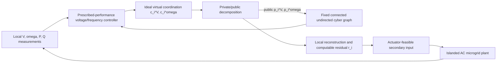

# Architecture Pruning Audit 0807

> Blueprint Freeze Version 2.0
> Frozen: 2026-08-07

## Scope and Decision Rule

This audit is a minimum-sufficient-architecture review before equation generation. It uses the six current design documents and the extracted IJSS and Privacy source papers. A module is retained only when it solves a problem that exists in the new microgrid framework and is needed to close a theorem-level claim. Source inheritance alone is not a retention reason.

The core contribution remains:

> privacy-preserving distributed prescribed-time secondary voltage/frequency control of an islanded AC microgrid, with transient-performance guarantees, droop-consistent active-power sharing, and public-history indistinguishability for a passive eavesdropper.

The audit does not turn the paper into a Nash-equilibrium paper, an attack-resilient paper, a cryptographic paper, or a sampled-data theory paper.

## Source-Faithful Findings

### IJSS

IJSS contains a physical inverter/droop and power-flow model, voltage and frequency prescribed-performance control, backstepping, adaptive projection, RBFNN approximation of unknown network/load terms, and a common steady-state frequency correction condition for power sharing. Its RBFNN and projection are engineering choices for the source uncertainty model; they are not automatically required by the new privacy question. The source's own explanation identifies continuous network/load coupling terms on a compact set as the objects approximated by RBFNN, while bounded disturbance terms are separately assumed.

### Privacy

The Privacy paper has a first-order Nash-seeking model with an explicit unknown disturbance `d_i(t)`. Its second-order PTESO is introduced specifically to estimate that disturbance and its derivative-related effect. The public/private state decomposition transmits one substate, retains another substate and internal weights privately, and constructs alternative private parameters that produce the same hostile-agent observations. The decomposition mechanism makes the substates and actual state converge to a common equilibrium; it does not establish a persistent nonzero physical reconstruction residual or an intrinsic privacy-performance floor.

## Module Necessity Table

| Module | Origin | Problem it solves | Required by new paper? | Keep/Delete/Simplify | Mathematical consequence | Reason |
|---|---|---|---|---|---|---|
| PTESO state equations | Privacy | Estimates explicit unknown first-order-system disturbances | No | Delete | Privacy residual and physical uncertainty enter a direct bounded-input interface; no observer lemma or deadline | The new controller has no unresolved disturbance state that is unavailable locally and indispensable to actuation. |
| PTESO error dynamics | Privacy | Proves prescribed-time observer error convergence | No | Delete | Remove B-E7/B-E8, observer errors, observer assumptions, and observer experiments | Observer convergence is not needed when uncertainty is assumed bounded and privacy residual is locally computable. |
| Observer deadlines `T_o^V`, `T_o^omega` | Privacy | Separates observer convergence time from plant time | No | Delete | Retain only physical deadlines `T_V`, `T_omega` | No observer exists in the minimal architecture. |
| Neighbor public-state estimator | Privacy | Reconstructs inaccessible or delayed neighbor quantities | No | Delete | Received `p_j^V`, `p_j^omega` enter coordination directly; remove `hat p_ij`, `epsilon_n`, and estimator lemma | The protocol already transmits the public states directly. No packet-loss, asynchronous, or partial-information theorem is in scope. |
| RBFNN approximation | IJSS | Approximates unknown network/load nonlinearities online | No for core paper | Delete | Replace NN residual and parameter-error terms with bounded physical uncertainty assumptions | Compact-domain boundedness is enough for the minimal prescribed-time proof; NN adaptation is not the privacy innovation. |
| Adaptive projection | IJSS | Prevents drift of NN parameter estimates | No | Delete | Remove A-E5, `Proj`, NN weights, and adaptive-weight assumptions | No online parameter estimate remains to constrain. |
| Fixed connected undirected cyber graph | Simplified choice | Supplies the minimum distributed information flow and a symmetric Laplacian | Yes | Keep | Use one fixed connected undirected `G_c` and one graph lemma/assumption | It supports distributed coordination, direct message receipt, and a clean privacy observation map with substantially lower proof cost. |
| Fixed strongly connected directed graph | Privacy-compatible option | Handles asymmetric information flow | Not for core | Move to future work | No directed Perron-vector or nonsymmetric stability proof in core | It adds graph complexity without changing the central privacy-control contribution. |
| Time-varying jointly connected directed graph | Privacy | Handles switching asymmetric communication | No for core | Delete from core; optional robustness only | Remove switching signal and joint-connectivity machinery | It is inherited topology complexity, not a required novelty. |
| Privacy residual `r_i^V`, `r_i^omega` | New adaptation of Privacy | Quantifies the transient mismatch introduced by source-style decomposition | Yes, in simplified form | Keep, but make it computable and decaying | Lemma 1 bounds the residual and establishes its decay; Theorems 1-3 use its direct bound | The source mechanism does not justify exact zero residual at every instant, so the residual cannot be silently erased. |
| Positive residual floor | Previous blueprint | Claimed persistent stronger privacy | No | Delete | Use a nonnegative residual schedule with decay to zero; remove persistent-floor branch | The Privacy source uses a decreasing `gamma_t` and proves asymptotic agreement, not a positive floor. |
| Privacy-performance tradeoff | Previous blueprint | Links masking strength to physical tolerance | Not as an intrinsic claim | Delete as central innovation; retain sensitivity observation only | No theorem claims a universal privacy-performance frontier | Privacy ambiguity, hidden-state magnitude, public dynamics, reconstruction error, and physical tracking error are distinct quantities. |
| Explicit common-mode projection | Previous blueprint | Forces frequency correction into a common subspace | No | Delete | Theorem 3 uses natural vanishing of differential privacy corrections and the nominal IJSS equilibrium condition | An extra projection is unnecessary if the privacy residual decays and the equilibrium constraint is imposed directly in the privacy dynamics. |
| Equilibrium constraint in frequency privacy dynamics | New minimal compatibility condition | Prevents a differential steady-state correction | Yes | Keep | Assumption 2/Lemma 1 require the differential frequency residual to vanish; Theorem 3 proves sharing | This is the least intrusive sharing-preservation mechanism. |
| Sampled-data equation map | Previous roadmap | Would connect continuous theory to digital messages | No for core | Delete from core | Remove N-E11, A15, `Delta_c`, `sigma_c`, `tau_k`, and Optional T7 | Sampling and timing remain HIL implementation details unless a separate theorem is later authorized. |
| Saturation/anti-windup dynamics | IJSS/implementation | Handles actuator limits and windup | Not as a dynamic module | Simplify | Keep actuator-feasibility assumption and HIL saturation logging; no anti-windup state or theorem | The core theorem assumes admissible inputs rather than introducing another controller subsystem. |
| HIL communication scheduler/logger | Implementation | Tests the protocol on a digital platform | Yes, HIL only | Keep outside theory | No theorem dependency; report sampling/rates as implementation metadata | HIL evidence is useful but cannot silently expand the continuous-time theorem. |

## Privacy Residual Audit

### Architecture A: Residual privacy wrapper

The public/private decomposition creates a public trajectory, a private internal trajectory, and a locally computed reconstructed coordination state. The difference between reconstructed and ideal coordination is retained as `r_i^V` or `r_i^omega`. In the minimal design this residual is bounded and decays according to a declared schedule. It is not estimated by an observer, and its magnitude is not automatically equated with privacy strength.

### Architecture B: Transparent privacy wrapper

An exact identity such as reconstructed coordination equals the ideal coordination at every instant would remove the physical residual. However, the Privacy source mechanism does not prove such an identity: it proves that the public/private substates and actual state converge to the same equilibrium, with a transient substate error governed by the decomposition dynamics. A new exact encoding/decoding protocol could potentially realize Architecture B, but it would require a new observation map, a new message-compatibility proof, and a new physical meaning for the protected state.

### Decision

Retain a simplified Architecture A with a computable, decaying residual. Do not claim a persistent positive floor. Do not claim an inherent privacy-performance tradeoff. A future exact transparent wrapper may be studied separately, but it is not assumed in the current paper because it is not supplied by the source mechanism.

## Cyber Topology Comparison

| Option | Theoretical complexity | Extra assumptions | Required proof objects | Privacy effect | Prescribed-time effect | Genuine novelty |
|---|---|---|---|---|---|---|
| A. Fixed connected undirected | Lowest | Connectivity, positive edge weights, reference pinning | Symmetric Laplacian/pinning bound and residual lemma | Observation equivalence is easiest to state | Direct bounded-input funnel analysis | Preserves the actual privacy-control novelty |
| B. Fixed strongly connected directed | Medium | Directed connectivity and positive left eigenvector or pinned stability | Nonsymmetric graph stability and weighted coordinates | More complex alternative-history construction | More conservative bounds | No new central contribution |
| C. Time-varying jointly connected directed | Highest | Switching regularity, joint connectivity, dwell/update conditions | Switching graph products, joint-pinning lemma, possibly estimators | Timing/topology history enlarges the observation map | Time-varying bounds and implementation caveats | Topology robustness only, not central privacy novelty |

### Topology decision

Use Option A in the core theory. Move directed or time-varying cyber graphs to future work or a clearly labeled non-theorem robustness experiment. The electrical graph remains separate and follows the physical microgrid model.

## Recommended Minimal Architecture

### Surviving modules

| Surviving module | Why indispensable | Required result | Source status | Genuine new content |
|---|---|---|---|---|
| Physical inverter/droop and power-flow model | Defines the plant, electrical coupling, and sharing relation | Definition 1, Theorems 1-3 | IJSS | Privacy wrapper is attached to this physical interface |
| Fixed undirected cyber graph | Supplies direct neighbor information for distributed coordination | Assumption 1, Lemma 1, Theorems 1-2 | Simplified IJSS/Privacy graph abstraction | Explicit separation of electrical and cyber coupling |
| Nominal prescribed-performance voltage/frequency controller | Creates funnel and prescribed-time physical objectives | Theorems 1-2 | IJSS adapted | Must close under bounded physical and privacy inputs without NN/observer stack |
| Public/private virtual coordination decomposition | Hides protected initial local coordination information | Definition 2, Lemma 1, Theorem 4 | Privacy adapted | Applied to microgrid virtual coordination rather than Nash actions |
| Computable decaying privacy residual | Captures the source mechanism's transient decomposition mismatch | Lemma 1, Theorems 1-3 | Newly specialized | Direct residual-to-funnel and residual-to-sharing interface |
| Frequency equilibrium compatibility condition | Prevents differential steady-state correction | Theorem 3 | New adaptation of IJSS sharing principle | Sharing is guaranteed without an explicit projection block |
| Passive-eavesdropper observation map | Makes the privacy claim testable against all public history | Definition 2, Theorem 4 | New formalization | Includes all public messages and disclosed topology/timing metadata |

## Deleted Modules

| Deleted module | Documents/equation families to remove or rewrite |
|---|---|
| PTESO and observer stack | Remove B-E7/B-E8; `d_i`, `hat d_i`, `epsilon_o`, `T_o^V`, `T_o^omega`, `Gamma_d`, `Phi_i`; remove observer assumptions, Lemma 2, observer metrics, observer figure, and observer-only ablation. |
| Neighbor public-state estimator | Remove B-E6; `hat p_ij`, `epsilon_n`, `E_n`; remove estimator graph assumptions, estimator proof stages, and estimator arrows from figures. |
| RBFNN and adaptive projection | Remove A-E5/A-E12; `Proj`, `Psi`, centers, widths, `W*`, `hat W`, `tilde W`, `epsilon_NN`, `E_NN`; replace with bounded uncertainty assumptions and direct robust/backstepping terms. |
| Directed/time-varying cyber topology | Remove directed/time-varying assumptions, switching signal, joint-connectivity claims, and topology-robustness theorem language. |
| Positive residual floor | Remove `epsilon_priv`, persistent-floor branch, and “stronger privacy requires larger tolerance” language. |
| Explicit common-mode projection | Remove N-E6, `u_{i,cm}^omega`, and projection figure/module; replace with a vanishing differential-residual/equilibrium condition in Lemma 1 and Theorem 3. |
| Sampled-data theory | Remove N-E11, A15, `Delta_c`, `sigma_c`, `tau_k`, and Optional T7. Keep HIL rates and saturation as implementation metadata only. |
| Anti-windup controller state | Remove any anti-windup state or proof dependency; retain only actuator-feasibility assumptions and HIL saturation logs. |

## Minimal Theorem Chain After Pruning

- **Definition 1:** admissible physical/cyber/private microgrid closed loop.
- **Definition 2:** public-history indistinguishability.
- **Assumption 1:** plant, reference, fixed-graph, bounded-uncertainty, initial-funnel, and actuator regularity.
- **Assumption 2:** admissible public/private decomposition, decaying residual, frequency equilibrium compatibility, and passive-eavesdropper access model.
- **Lemma 1:** public/private decomposition well-posedness, computable residual bound, residual decay, and admissible alternative private realizations.
- **Theorem 1:** closed-loop boundedness and funnel invariance under bounded physical uncertainty and decaying residual.
- **Theorem 2:** practical prescribed-time voltage/frequency recovery.
- **Theorem 3:** droop-consistent active-power sharing because the differential frequency privacy correction vanishes at equilibrium.
- **Theorem 4:** public-history indistinguishability plus the composite boundedness/recovery/sharing guarantee.

No separate observer lemma, graph-estimator lemma, NN lemma, projection lemma, or communication-robustness theorem remains.

## Cross-Document Dead-Code Inventory

The following are dead once the minimal architecture is adopted and must not survive in any of the six design documents:

- PTESO/observer states, errors, deadlines, derivative bounds, peaking metrics, and observer-only experiments;
- neighbor public-state estimates and their errors;
- RBF basis functions, centers, widths, ideal/estimated weights, parameter errors, approximation residuals, projection operators, and NN-specific assumptions;
- directed/time-varying graph variables, switching signals, joint-connectivity clauses, and nonsymmetric graph proof tools;
- positive privacy residual floors, `epsilon_priv`, and a theorem-level privacy-performance tradeoff;
- explicit common-mode projection variables and module claims;
- sampled-data equation block N-E11, A15, Optional T7, and core sampling variables;
- anti-windup state variables;
- observer figure/table rows, observer-only ablation, and any theorem dependency that points to a deleted block.

## Architecture Freeze Candidate

### Essential modules

- Physical IJSS microgrid/droop model with bounded uncertainty;
- fixed connected undirected cyber graph with direct public-state receipt;
- nominal prescribed-performance distributed voltage/frequency controller;
- Privacy-style public/private virtual coordination decomposition;
- computable decaying privacy residual and admissible alternative private realizations;
- frequency equilibrium compatibility condition for power sharing;
- passive-eavesdropper public-history observation map and indistinguishability proof.

### Supporting modules

- Backstepping and error-funnel transformation from IJSS;
- direct bounded-uncertainty treatment of network/load terms;
- HIL logging of public messages, residuals, saturation, and electrical metrics;
- optional directed/time-varying graph sensitivity tests without theorem-level claims.

### Removed baggage

- PTESO and all observer infrastructure;
- RBFNN and adaptive projection;
- neighbor estimator;
- directed/time-varying topology in the core theorem;
- persistent residual floor and intrinsic privacy-performance tradeoff;
- explicit common-mode projection;
- sampled-data theorem infrastructure and Optional T7;
- anti-windup dynamics.

### Remaining mathematical decisions

- Exact public/private decomposition and local reconstruction map;
- exact residual decay condition and its channel-specific bound;
- robust/backstepping controller form under bounded physical uncertainty;
- fixed-graph pinning convention and electrical/cyber graph dimensions;
- precise equilibrium compatibility condition for the frequency channel;
- whether the local physical controller uses the residual explicitly or only its bound.

### Critical risks

- A transparent exact reconstruction may not be compatible with a non-unique public history unless a new encoding/decoding construction is proved.
- If the residual is only bounded but not shown to decay, exact asymptotic droop sharing cannot be claimed; the theorem must then state a residual-dependent sharing bound.
- Treating all network/load coupling as a bounded uncertainty may shrink the admissible operating region and weaken the engineering claim compared with IJSS.
- Direct receipt of public states removes estimator complexity but makes the fixed graph and message semantics part of the theorem assumptions.
- A passive eavesdropper that reads physical sensors or local memory remains outside the privacy theorem.

The architecture is a freeze candidate, not yet the final equation-generation specification.
