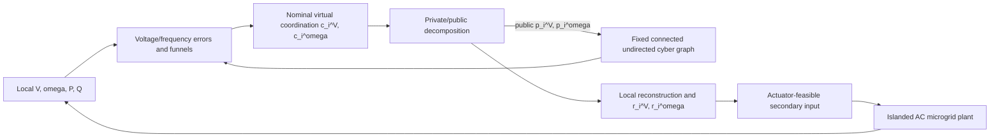

# Blueprint 0807: Minimal Privacy-Preserving Prescribed-Time Secondary Control

> Blueprint Freeze Version 2.0
> Frozen: 2026-08-07

## 0. Status

This is a pre-equation blueprint after the architecture-pruning audit. It is not a paper draft and contains no controller derivation. The design is intentionally minimal:

> an islanded AC microgrid with a nominal prescribed-performance distributed secondary controller, a public/private virtual coordination wrapper, a fixed connected undirected cyber graph, and a decaying privacy residual compatible with droop-consistent power sharing.

The core theory is continuous-time. Sampling, quantization, communication delays, packet loss, and platform rates are HIL implementation details only and do not enter the core theorem.

## 1. Title Candidates

1. **Privacy-Preserving Distributed Prescribed-Time Secondary Control for Islanded AC Microgrids**
2. **Private Virtual Coordination for Prescribed-Time Voltage and Frequency Restoration in Islanded Microgrids**
3. **Public-History-Indistinguishable Prescribed-Time Secondary Control of Islanded AC Microgrids**
4. **Privacy-Preserving Prescribed-Time Voltage/Frequency Restoration with Droop-Consistent Power Sharing**
5. **Distributed Secondary Control of Islanded Microgrids with Private Coordination States and Transient Guarantees**

Recommended title: Candidate 1. It states the application, control problem, and privacy mechanism without implying Nash seeking or active cybersecurity.

## 2. Paper Identity and Claim Spine

### 2.1 Research question

Can an islanded AC microgrid preserve practical prescribed-time voltage/frequency recovery, prescribed transient envelopes, and droop-consistent active-power sharing when neighbors receive only public virtual coordination states and a passive eavesdropper observes the complete public history?

### 2.2 Source roles

| Source | Retained role | Explicitly excluded |
|---|---|---|
| IJSS | Physical inverter/droop model, electrical power flow, voltage/frequency prescribed-performance controller, bounded uncertainty treatment, and steady-state sharing relation | RBFNN and adaptive projection as historical implementation baggage |
| Privacy | Public/private state decomposition, private internal parameters, passive observation model, and public-history indistinguishability construction | Nash cost functions, gradients, PTESO, directed/switching graph complexity, and its neighbor estimator |

### 2.3 Main contribution

The central contribution is a microgrid-specific communication-control co-design that applies Privacy-style public/private decomposition to virtual secondary coordination states while retaining physical prescribed-performance and power-sharing guarantees. The new result is the joint theorem, not the isolated reuse of either source controller.

### 2.4 Claim hierarchy

1. The closed loop is well posed and bounded on a declared operating region.
2. Voltage and frequency errors remain inside their prescribed transient envelopes.
3. Voltage and frequency enter their practical tolerances by designer-selected deadlines.
4. The differential steady-state privacy correction vanishes, so the nominal droop-sharing relation is preserved.
5. Alternative private initializations can generate the same complete public history under a passive eavesdropper model.

### 2.5 Non-claims

The paper does not claim Byzantine resilience, false-data-injection resilience, replay resilience, denial-of-service resilience, cryptographic confidentiality, differential privacy, protection against compromised local memory, or privacy against an adversary with direct physical sensor access.

## 3. Section Hierarchy

### 1. Introduction

#### 1.1 Microgrid communication and privacy problem
#### 1.2 Gap between prescribed-time control and privacy-preserving coordination
#### 1.3 Research question and design requirements
#### 1.4 Minimal proposed architecture
#### 1.5 Contributions and non-claims
#### 1.6 Paper organization

### 2. Related Foundations

#### 2.1 Distributed secondary voltage/frequency control
#### 2.2 Public/private state decomposition
#### 2.3 Public-history indistinguishability
#### 2.4 Gap and source-boundary statement

### 3. Problem Formulation

#### 3.1 Islanded AC microgrid and droop model
#### 3.2 Electrical graph and power-flow coupling
#### 3.3 Fixed connected undirected cyber graph
#### 3.4 Virtual voltage/frequency coordination states
#### 3.5 Public/private decomposition and local reconstruction
#### 3.6 Passive eavesdropper observation map
#### 3.7 Control objectives and practical prescribed-time definition
#### 3.8 Assumptions

### 4. Privacy-Preserving Coordination Layer

#### 4.1 Public/private initialization
#### 4.2 Public-state transmission and direct neighbor receipt
#### 4.3 Private internal evolution
#### 4.4 Local reconstruction and computable residual
#### 4.5 Residual decay and frequency equilibrium compatibility
#### 4.6 Observation-equivalence construction

### 5. Prescribed-Time Secondary Controller

#### 5.1 Voltage channel
#### 5.2 Frequency channel
#### 5.3 Error-funnel transformation
#### 5.4 Bounded physical uncertainty interface
#### 5.5 Actuator-feasibility assumption
#### 5.6 Controller execution order

### 6. Theoretical Analysis

#### 6.1 Lemma 1: decomposition regularity and residual property
#### 6.2 Theorem 1: boundedness and funnel invariance
#### 6.3 Theorem 2: practical prescribed-time recovery
#### 6.4 Theorem 3: droop-consistent active-power sharing
#### 6.5 Theorem 4: privacy and composite guarantee
#### 6.6 Proof dependency graph

### 7. Simulation and Privacy Validation

#### 7.1 Plaintext reconstruction baseline
#### 7.2 Complete privacy wrapper
#### 7.3 Residual-decay sensitivity and unsafe raw-state negative control
#### 7.4 Adversary-view public-history test
#### 7.5 Metrics and acceptance criteria

### 8. HIL Validation

#### 8.1 Four-DG electrical plant
#### 8.2 Fixed cyber message implementation
#### 8.3 Public-message logging and residual logging
#### 8.4 Electrical and adversary-view results

### 9. Discussion and Limitations

#### 9.1 Privacy target boundary
#### 9.2 No intrinsic privacy-performance tradeoff claim
#### 9.3 Fixed-graph limitation
#### 9.4 Future active-security and sampled-data extensions

## 4. Minimal Architecture

The electrical graph controls physical power-flow coupling. The cyber graph controls information flow. The public state is the only regular coordination payload. Raw voltage, frequency, active power, reactive power, control commands, private substates, private weights, and local memory are excluded from the payload.

## 5. Privacy Layer Contract

### 5.1 Core target

The protected quantity is the initial local virtual secondary coordination state. Load, rating, droop, and physical sensor privacy are outside the core target.

### 5.2 Residual decision

The Privacy source mechanism proves convergence of public/private substates and the actual state to a common equilibrium, not exact identity at every transient instant. Therefore the new paper keeps a channel-specific residual `r_i^V`, `r_i^omega` as a computable, bounded, decaying quantity. It must not be assigned a positive floor by assumption unless a later derivation proves one.

Architecture B, an exact transparent reconstruction with no physical residual, is not adopted as a hidden assumption. It would require a new encoding/decoding mechanism and a new indistinguishability proof. The current paper uses the source-faithful decaying-residual wrapper and does not claim an intrinsic privacy-performance frontier.

### 5.3 Observation map

The public history includes every transmitted public coordination state, public controller parameter, fixed cyber topology information, and disclosed protocol metadata. The eavesdropper has no private-memory or physical-sensor access.

### 5.4 Frequency compatibility

The privacy dynamics must make the differential steady-state frequency correction vanish. This condition replaces an explicit common-mode projection block. The nominal equal steady-state secondary correction then preserves the IJSS droop-sharing relation.

## 6. Controller Organization

### 6.1 Execution order

At each continuous-time update:

1. measure local physical states and process references;
2. receive public states from the fixed cyber neighbors;
3. form local voltage/frequency distributed errors directly from received states;
4. compute ideal virtual coordination states;
5. update public/private decomposition states;
6. reconstruct local coordination states and evaluate the computable residual;
7. assemble the prescribed-performance/backstepping secondary input under bounded-uncertainty assumptions;
8. inject the actuator-feasible input into the plant.

There is no observer update, neighbor estimator, adaptive NN update, switching-graph update, or common-mode projection stage.

### 6.2 Module ownership

| Module | Inputs | Outputs | Required result |
|---|---|---|---|
| Physical plant/droop | Local secondary inputs, loads, electrical neighbors | `V_i`, `omega_i`, `P_i`, `Q_i` | Definition 1; Theorem 1 |
| Voltage funnel/controller | Local voltage, references, received public states | `c_i^V`, voltage secondary input | Theorems 1-2 |
| Frequency funnel/controller | Local frequency, references, received public states | `c_i^omega`, frequency secondary input | Theorems 1-3 |
| Privacy wrapper | `c_i^V`, `c_i^omega`, private parameters | `p_i`, `q_i`, reconstructed state, `r_i` | Lemma 1; Theorem 4 |
| Public-history map | All public payload and metadata | `O_adv[0,t]` | Definition 2; Theorem 4 |

## 7. Theorem Architecture

- **Definition 1:** admissible physical/cyber/private microgrid closed loop.
- **Definition 2:** public-history indistinguishability.
- **Assumption 1:** plant, references, fixed graph, bounded uncertainty, initial funnel, and actuator regularity.
- **Assumption 2:** privacy decomposition admissibility, computable residual decay, frequency equilibrium compatibility, and passive-eavesdropper access.
- **Lemma 1:** public/private decomposition well posedness, residual bound/decay, and alternative private realizations.
- **Theorem 1:** closed-loop boundedness and prescribed-performance funnel invariance.
- **Theorem 2:** practical prescribed-time voltage/frequency recovery.
- **Theorem 3:** droop-consistent active-power sharing.
- **Theorem 4:** public-history indistinguishability and simultaneous boundedness/recovery/sharing guarantee.

The privacy proof is an observation-equivalence construction and remains logically separate from the physical funnel proof inside Theorem 4.

## 8. Experiment Roadmap

### Stage 0: Plaintext baseline

Reproduce the IJSS physical controller with the same plant, references, graph, disturbances, and prescribed deadlines. Report practical tolerance entry and sharing error quantitatively.

### Stage 1: Privacy-wrapper unit test

Test bounded public/private states, admissible private weights, computable residual decay, and multiple private initializations with identical public histories.

### Stage 2: Core simulation cases

| Case | Privacy wrapper | Residual schedule | Purpose |
|---|---:|---|---|
| B0 | No | None | Plaintext IJSS-style baseline |
| B1 | Yes | Decaying residual, complete method | Validate the proposed architecture |
| B2 | Yes | Slower-decay sensitivity case | Show residual sensitivity without claiming an intrinsic tradeoff |
| B3 | Raw physical-state mask | Not applicable | Negative control showing why privacy acts on virtual coordination states |

All cases use the same physical plant and disturbance realization when compared.

### Stage 3: Adversary-view validation

The adversary logger receives exactly `O_adv[0,t]`. Report the compatible private-initialization set, reconstruction error, public-history equality/equivalence, and leakage from disclosed metadata. Do not provide private memory or physical sensors to the logger.

### Stage 4: HIL validation

Use the four-DG electrical plant with a fixed cyber message schedule. Log controller rate, communication rate, payload, saturation events, public histories, local residuals, voltage/frequency errors, and active-power sharing. HIL sampling and saturation are implementation facts, not core theorem claims.

## 9. Metrics and Evidence

| Metric | Purpose | Acceptance |
|---|---|---|
| `T_{V,meas}`, `T_{omega,meas}` | Physical tolerance entry | No greater than designed `T_V`, `T_omega` under nominal assumptions |
| `E_env` | Funnel violation | Zero under nominal theorem conditions |
| `E_V`, `E_omega` | Final physical errors | Within declared practical tolerances |
| `E_share` | Sharing deviation | Zero in the vanishing-residual limit or within the stated residual-dependent bound |
| `R_priv` | Local privacy residual | Within the declared decaying bound |
| `E_inv`, `A_priv` | Adversary reconstruction and ambiguity | Protected initial state remains non-unique |
| `U_peak`, `M_payload`, `N_seed` | Engineering cost and reproducibility | Report for every case |

## 10. Figure and Table Plan

### Figures

1. Electrical/cyber two-graph architecture.
2. Public/private virtual coordination layer.
3. Minimal controller data flow without observer or estimator blocks.
4. Voltage funnel and prescribed-time recovery.
5. Frequency recovery and droop-consistent sharing.
6. Public-history indistinguishability and adversary view.
7. Residual-decay sensitivity and unsafe raw-state negative control.
8. HIL electrical and public-message results.

### Tables

1. Main notation and signal ownership.
2. Assumptions and theorem usage.
3. Electrical, cyber, controller, privacy, and HIL parameters.
4. Baseline and ablation configurations B0-B3.
5. Claim-to-evidence mapping.
6. Threat-model scope and limitations.

No table is reserved for observers, NN parameters, graph switching, or sampled-data theorems because those modules are deleted.

## 11. Architecture Freeze Candidate

### Essential modules

- physical IJSS microgrid/droop model with bounded uncertainty;
- fixed connected undirected cyber graph with direct public-state receipt;
- nominal prescribed-performance voltage/frequency controller;
- public/private virtual coordination decomposition;
- computable decaying privacy residual;
- frequency equilibrium compatibility condition;
- passive-eavesdropper public-history observation map.

### Supporting modules

- IJSS error-funnel transformation and backstepping;
- compact-region boundedness assumptions for network/load terms;
- HIL message logging and saturation reporting;
- optional directed/time-varying sensitivity tests without theorem claims.

### Removed baggage

PTESO, all observer states and deadlines, neighbor public-state estimators, RBFNN, adaptive projection, directed/time-varying cyber topology in the core theorem, positive privacy residual floor, intrinsic privacy-performance tradeoff, explicit common-mode projection, sampled-data theorem infrastructure, Optional T7, and anti-windup dynamics.

### Remaining mathematical decisions

- exact decomposition and reconstruction map;
- residual decay condition and channel-specific bound;
- robust/backstepping controller form under bounded physical uncertainty;
- fixed-graph pinning convention;
- precise frequency equilibrium compatibility condition;
- whether the residual is used explicitly or only bounded in the controller proof.

### Critical risks

- A new exact transparent reconstruction cannot be assumed without a new indistinguishability construction.
- If residual decay is not proved, Theorem 3 must use a residual-dependent sharing bound rather than exact sharing.
- Replacing RBFNN with bounded uncertainty may reduce the admissible operating region and must be stated honestly.
- Direct public-state receipt makes the fixed graph and message semantics explicit theorem assumptions.
