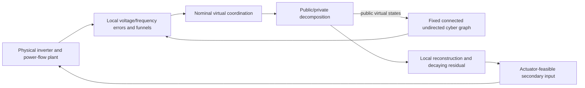

# Design Report 0807: Minimum-Sufficient Privacy-Preserving Secondary Control

> Blueprint Freeze Version 2.0
> Frozen: 2026-08-07

## Scope

This report is a research-design audit, not a manuscript and not an equation derivation. It defines the smallest defensible architecture for privacy-preserving distributed prescribed-time secondary voltage/frequency control of an islanded AC microgrid.

The design question is:

> Can the microgrid retain prescribed transient envelopes, practical recovery deadlines, and droop-consistent active-power sharing when only virtual secondary coordination states are exchanged publicly?

The paper is a new communication-control co-design. It is not a mechanical merger of the two sources.

## 1. Independent Analysis of IJSS

### Core contribution

IJSS supplies the physical backbone: inverter droop and power-flow relations, separate voltage and frequency secondary channels, distributed pinning/consensus errors, prescribed-performance transformation, backstepping, bounded treatment of unknown network/load terms, and a steady-state condition connecting equal frequency compensation to active-power sharing.

### Keep

- islanded inverter, droop, load, and electrical power-flow model;
- separate voltage and frequency channels;
- local distributed errors with reference pinning;
- prescribed-performance funnels and practical prescribed-time recovery;
- channel-specific controller design and bounded physical uncertainty interface;
- droop-sharing equilibrium relation;
- simulation and HIL validation as evidence pathways.

### Do not reuse as automatic requirements

The backbone does not force a particular approximation or adaptation implementation. The new paper should not inherit source-specific neural/adaptation machinery unless an equation-level uncertainty cannot be bounded on the declared operating region. Source claims of exact/global convergence, delay robustness, or exact HIL sharing must be rechecked rather than copied.

## 2. Independent Analysis of Privacy

### Core contribution

The Privacy source provides a public/private state decomposition, direct public-state transmission, private internal parameters, a passive eavesdropper observation model, and an indistinguishability construction in which different protected initializations can explain the same public history.

### Keep

- public and private substates on a virtual coordination signal;
- direct receipt of public neighbor states;
- hidden local decomposition parameters;
- complete public-history observation map;
- existence-based public-history indistinguishability under a passive eavesdropper;
- local boundedness and residual analysis for the decomposition.

### Do not reuse

The Nash objective, gradients, first-order game plant, and game-specific assumptions are outside ordinary microgrid secondary control. The source privacy result does not imply cryptographic secrecy, active-attack resilience, or protection from physical sensor side channels. It also does not prove exact transparent transient reconstruction in the microgrid setting.

## 3. Conflicts and Resolutions

| Conflict | Resolution |
|---|---|
| Privacy source acts on an abstract state; IJSS regulates physical voltage/frequency | Decompose a virtual secondary coordination state, never raw plant measurements. |
| Channel dynamic orders differ | Keep voltage and frequency channels separate and channel-specific. |
| A hidden decomposition can perturb the physical input | Name the local reconstruction mismatch as a bounded, decaying residual and include it in the funnel budget. |
| Differential frequency corrections can alter droop sharing | Require the differential steady-state privacy correction to vanish; use no separate projection block. |
| Physical and communication neighborhoods need not coincide | Define electrical and cyber graphs independently. |
| Continuous-time theory versus implementation sampling | Keep the theorem continuous-time; report sampling and saturation only as HIL facts. |

## 4. Module Necessity Decisions

| Module | Origin | Problem it solves | Required by new paper? | Decision | Consequence |
|---|---|---|---|---|---|
| PTESO | Privacy | Estimates an unavailable additive disturbance | No: the new controller assumes bounded physical uncertainty and has no unavailable disturbance state | Delete | Removes observer states, observer assumptions, observer proof, and observer experiments. |
| Neighbor public-state estimator | Privacy | Reconstructs an inaccessible neighbor state | No: public neighbor states are directly received | Delete | Received public values enter coordination directly. |
| RBF approximation | IJSS | Approximates unknown nonlinear functions online | No under a declared compact operating region with bounded nonlinear terms | Delete | Bounds enter the controller proof directly. |
| Adaptive projection | IJSS | Prevents parameter drift in an adaptive approximator | No approximator remains | Delete | Removes projection operator and adaptive-weight dynamics. |
| Directed cyber graph | Privacy extension | Handles non-symmetric information flow | Not needed for the core claim | Simplify to fixed connected undirected graph | Enables a symmetric-Laplacian proof with fewer assumptions. |
| Time-varying graph | Privacy extension | Handles switching connectivity | Not needed for the core claim | Delete from core theory | No switching signal or joint-connectivity lemma. |
| Privacy residual | New coupling | Records the transient reconstruction mismatch seen by the plant | Yes, unless a new exact transparent encoder is independently proved | Keep, bounded and decaying | Gives an explicit privacy-to-funnel interface. |
| Positive residual floor | Heuristic | Claims stronger privacy through permanent physical mismatch | No source theorem establishes it | Delete | No intrinsic privacy-performance tradeoff claim. |
| Privacy-performance frontier | Heuristic | Links privacy strength to physical error | Not intrinsic without a proved inequality | Delete as a theorem claim | Report sensitivity only. |
| Common-mode projection | IJSS-inspired adaptation | Forces equal frequency correction | Not necessary if equilibrium compatibility is imposed structurally | Delete | Sharing follows from the frequency equilibrium condition. |
| Sampled-data map | Future extension | Models sampling/delay/dropout/quantization | No continuous-time theorem uses it | Delete from core theory | Sampling remains implementation metadata. |
| Communication robustness theorem | Future extension | Proves delay/dropout tolerance | No corresponding model is retained | Delete | No unsupported robustness claim. |
| Anti-windup dynamic block | Implementation option | Handles actuator saturation dynamically | Not needed for the theorem if feasibility is assumed | Simplify to feasibility assumption | Saturation is measured in HIL, not analyzed as a new state. |

## 5. Recommended Minimal Architecture

### Indispensable modules

1. The IJSS physical model is required to state voltage, frequency, power flow, and sharing.
2. The nominal prescribed-performance controller is required for funnel invariance and practical deadline claims.
3. A fixed connected undirected cyber graph is required for direct distributed coordination with a tractable core proof.
4. Public/private decomposition is the privacy mechanism and is required for the indistinguishability claim.
5. A locally computable decaying residual is required because the source-faithful decomposition need not reconstruct the ideal command exactly during transients.
6. A frequency equilibrium compatibility condition is required for droop-consistent sharing.
7. The observation map and passive-eavesdropper model are required to make the privacy claim falsifiable.

### Supporting, not novel

Backstepping, compact-region boundedness, HIL logging, saturation reporting, and parameter tables support reproducibility but do not constitute independent innovations.

## 6. Privacy and Performance Boundary

The protected target is the initial local virtual-coordination quantity. The adversary sees public messages, public parameters, topology/timing metadata, and nothing in private memory or local physical sensors.

The residual is a bounded schedule that decays as required by the sharing theorem. Privacy ambiguity, decomposition magnitude, public-state trajectories, reconstruction error, and physical tracking error must be reported as separate quantities. No claim may equate larger ambiguity with a necessary physical-performance loss.

An exact transparent wrapper is not assumed: it would require a new encoding/decoding map and a new observation-equivalence proof. The present architecture therefore preserves a source-faithful decaying-residual interface and states its residual-dependent limitations explicitly.

## 7. Theorem-Level Story

1. Define the admissible physical/cyber/private closed loop and the public-history privacy target.
2. Assume plant regularity, fixed graph connectivity, bounded uncertainty, funnel-compatible initialization, actuator feasibility, decomposition admissibility, residual decay, and a passive eavesdropper.
3. Prove decomposition well-posedness, boundedness, residual behavior, and alternative private realizations.
4. Use that residual bound in the physical Lyapunov argument to prove closed-loop boundedness and funnel invariance.
5. Convert funnel invariance to practical prescribed-time voltage/frequency recovery.
6. Use the zero differential steady-state frequency correction to prove droop-consistent active-power sharing.
7. Compose the privacy and physical results without hiding one proof inside the other.

## 8. Innovation Assessment

| Candidate innovation | Classification | Role |
|---|---|---|
| Privacy-preserving virtual coordination for prescribed-time microgrid control | Substantial | Main architectural novelty. |
| Joint residual-aware funnel and boundedness theorem | Substantial | New coupling between privacy and transient safety. |
| Public-history indistinguishability on physical secondary-control interfaces | Substantial | Application-specific privacy result. |
| Equilibrium-compatible frequency privacy dynamics | Incremental to moderate | Enables sharing preservation. |
| Fixed-graph HIL privacy instrumentation | Supporting | Evidence, not a theorem-level novelty. |

The first two items should support the main contribution statement; the sharing condition and HIL results should substantiate it.

## 9. Deleted-Module Propagation

The following are absent from the final controller, variable dictionary, notation contract, roadmap, and theorem graph: observer states and deadlines; neighbor estimates and estimator errors; neural basis, centers, widths, weights, approximation residuals, and projection; switching/directed graph variables; positive residual floors and privacy-budget aliases; explicit common-mode control; sampled-data state/timing equations; optional communication-robustness theorem; and anti-windup dynamics. The audit file remains the sole record of why these inherited modules were removed.

Experiments therefore use only a plaintext baseline, the complete decaying-residual method, a residual-decay sensitivity case, and a raw-physical-state masking negative control. No deleted module receives an ablation, figure, or metric.

## 10. Architecture Freeze Candidate

### Essential modules

Physical microgrid/droop model; separate electrical and cyber graphs; fixed connected undirected cyber communication; prescribed-performance voltage/frequency controller; public/private virtual coordination; bounded decaying residual; frequency equilibrium compatibility; passive public-history privacy target.

### Supporting modules

Backstepping details, compact-region bounds, HIL logging, and implementation-rate reporting.

### Removed baggage

All observer, estimator, online approximation, graph-switching, positive-floor, projection, sampled-data, and anti-windup modules identified in the audit.

### Remaining mathematical decisions

Only the exact decomposition/reconstruction map, residual schedule and bounds, robust controller form, pinning convention, frequency equilibrium condition, and residual-entry point in the controller proof remain to be derived.

### Critical risks

The privacy mechanism must actually admit alternative private realizations with identical complete public histories. If residual decay is insufficient for exact asymptotic sharing, the sharing theorem must state a residual-dependent bound. Replacing online approximation by bounded uncertainty may reduce the certified operating region and must be reported honestly.
