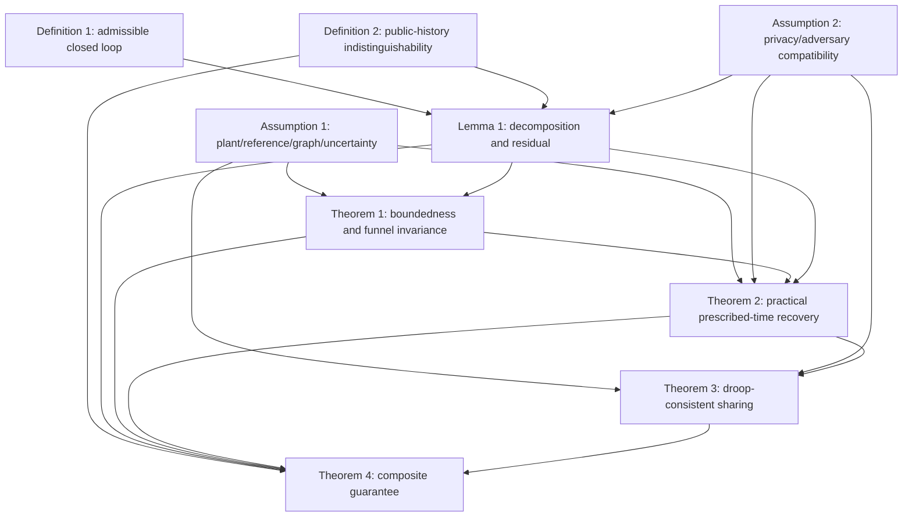

# Theorem Dependencies Design 0807: Minimal Architecture

> Blueprint Version 2.2
> Privacy-Schedule Regularity Revision: 2026-08-11
> Predecessor: Blueprint Version 2.1, Privacy-Domain Revision
> Historical baseline: Blueprint Freeze Version 2.0, frozen 2026-08-07

## Scope

This document freezes the smallest theorem chain needed for the pruned architecture. It contains definitions, assumptions, lemma/theorem statements, dependencies, and claim boundaries. It contains no proofs or equation derivations.

## Definition 1

### Admissible privacy-preserving microgrid closed loop

An admissible closed loop consists of an islanded AC microgrid with inverter droop and electrical power-flow coupling, a separate fixed connected undirected cyber graph, voltage and frequency prescribed-performance secondary channels, a virtual coordination state for each channel, a public substate transmitted to neighbors, a private substate and private parameters retained locally, a local reconstruction rule, bounded physical uncertainty, and actuator-feasible secondary inputs.

Raw voltage, angular frequency, active power, reactive power, private substates, private parameters, and local memory are not regular public messages.

### Why Definition 1 exists

It fixes the object being analyzed and prevents the state-decomposition mechanism from being mistaken for a direct physical-state mask. It also fixes the electrical/cyber graph separation and the local reconstruction interface.

### Source status

The physical plant and prescribed-performance roles are inherited from IJSS. The public/private virtual interface and fixed two-graph contract are newly specialized.

## Definition 2

### Public-history indistinguishability

Let `O_adv[0,t]` contain every public coordination message, public controller parameter, fixed cyber-topology information, and disclosed protocol metadata visible to the passive eavesdropper. Two admissible private initializations are publicly indistinguishable when they generate the same `O_adv[0,t]` under the same public references, graph, and protocol conditions while their protected local initial virtual coordination states differ.

The privacy target is non-unique reconstruction from the complete public history, not visual similarity and not differential privacy.

### Why Definition 2 exists

It gives the privacy theorem an exact observation object and prevents the paper from claiming protection against unobserved physical side channels.

### Source status

The non-unique reconstruction idea is adapted from the Privacy paper. The public-history scope and microgrid protected quantity are new.

## Assumption 1

### Plant, reference, graph, and uncertainty regularity

Assume that:

1. the physical plant is locally well posed on a compact admissible operating region;
2. electrical parameters, loads, droop gains, and bounded physical/network uncertainties satisfy the declared bounds;
3. voltage and frequency references and required derivatives are bounded and available through permitted local or pinned channels;
4. the electrical graph has the required physical connectivity;
5. the cyber graph is fixed, connected, undirected, and properly pinned;
6. initial tracking errors lie inside the prescribed-performance funnels;
7. secondary inputs remain actuator-feasible.

### Why Assumption 1 exists

It supplies existence, bounded nonlinear terms, graph information flow, funnel initialization, and implementable control inputs. It replaces the deleted RBFNN approximation-region, PTESO derivative-bound, switching-graph, and sampled-data assumptions.

## Assumption 2

### Privacy decomposition and adversary compatibility

Assume that:

1. private substates and coupling parameters are initialized in an admissible bounded set;
2. for every agent/channel pair affected through the coupled alternative construction, `|z_j^nu(0)| >= eta_{z,j}^nu > 0`;
3. on a declared common local seed interval, the relevant designer-selected nominal schedules satisfy `underline(w)_j^nu+eta_{w,j}^nu <= w_{j,12}^nu(t),w_{j,21}^nu(t) <= bar(w)_j^nu-eta_{w,j}^nu`, with `eta_{w,j}^nu>0` and `2eta_{w,j}^nu < bar(w)_j^nu-underline(w)_j^nu`;
4. on the fixed common finite seed interval `I_s=[0,T_s]`, `T_s>0`, each affected public schedule satisfies `gamma_priv,j^nu(t)>=eta_{gamma,j}^nu>0`;
5. the affected scope is network-wide along the frozen physical/electrical coupling and may be reduced only after a proof that a smaller affected subset is closed;
6. the public/private decomposition and local reconstruction are well defined;
7. the voltage/frequency privacy residuals are locally computable, bounded by declared nonnegative schedules, and decay as required by the physical theorem;
8. the differential steady-state frequency privacy correction vanishes;
9. the eavesdropper observes all public messages and disclosed metadata but cannot access private local memory or physical sensors;
10. active message manipulation and communication failures are outside the core model.

Items 2--5 provide only designer-selectable local domain margins. Item 4 is equivalent to a bounded reciprocal schedule on `I_s` and does not restrict decay after `T_s`. The privacy singular set is the union of `z_j^nu=0` and `gamma_priv,j^nu=0` over affected pairs. Privacy conclusions stop at the earliest of `T_s` and the first exit from the regular local domain; no invariance is assumed. These items do not assume an alternative realization, identical public history, a nonzero perturbation radius, or validity of ES-58--ES-61. Those remain conclusions to be established by PO-04 and PO-05.

### Why Assumption 2 exists

It is the minimum bridge between privacy and physical control. Blueprint Version 2.1 added the split/weight margins needed to exclude the Task-010 zero-split counterexample. Version 2.2 adds only the finite-seed schedule separation needed to exclude the Task-013 unbounded-reciprocal counterexample. Alternative existence remains unassumed. The assumption also supplies residual, sharing-compatibility, and passive-observation boundaries without adding an observer or attack-resilience subsystem.

## Lemma 1

### Public/private decomposition regularity and residual property

Under Definitions 1-2 and Assumption 2, the public/private substates and private parameters remain well posed and bounded. The local reconstructed coordination states are computable, and the channel-specific residuals `r_i^V` and `r_i^omega` satisfy their declared bounds and decay conditions. On the regular privacy design domain, existence of a non-nominal private realization with the same public history is retained as a conclusion only after PO-04 and PO-05 close.

### Why Lemma 1 exists

This is the only supporting lemma needed after pruning. It supplies both the physical residual interface and the privacy construction. It prevents privacy from appearing as an undefined disturbance and prevents the indistinguishability claim from being based on a plot.

### What Lemma 1 proves

- public/private state boundedness;
- admissibility of private parameters;
- local computability and boundedness of the reconstruction residual;
- the residual decay condition required by the sharing theorem;
- after PO-04/PO-05 closure, existence of an alternative private explanation with identical public history on the common local-before-exit interval.

### Source status

The decomposition and private-parameter construction are adapted from the Privacy paper. The channel-specific residual interpretation and microgrid compatibility conditions are new.

## Theorem 1

### Closed-loop boundedness and prescribed-performance invariance

Under Definition 1, Assumptions 1-2, and Lemma 1, the complete closed loop is well posed on the declared operating region. Physical states, public/private virtual states, transformed errors, and admissible secondary inputs remain bounded, and voltage/frequency errors remain inside their prescribed-performance envelopes.

### Why Theorem 1 exists

It is the physical safety gate. The paper cannot claim a deadline guarantee if the funnel can be crossed or a privacy state can become unbounded before the deadline.

### What it proves

- bounded augmented trajectory;
- bounded direct uncertainty and privacy-residual inputs;
- bounded transformed errors;
- funnel invariance;
- actuator-feasible control signals under the stated assumption.

It does not yet claim final tolerance entry or privacy.

## Theorem 2

### Practical prescribed-time voltage and frequency recovery

Under Assumptions 1-2, Lemma 1, and Theorem 1, all DG voltage errors enter their final practical tolerance by `T_V`, and all DG frequency errors enter their final practical tolerance by `T_omega`. The tolerances include the declared bounded physical uncertainty and privacy-residual contribution. Exact-zero convergence is not claimed unless separately derived.

### Why Theorem 2 exists

It is the main physical performance result. Observer deadlines are absent because no observer is part of the minimal architecture.

### What it proves

- voltage tolerance entry by the designed voltage deadline;
- frequency tolerance entry by the designed frequency deadline;
- continued practical boundedness after the deadlines;
- explicit residual-dependent tolerance statement.

## Theorem 3

### Droop-consistent active-power sharing

Under Assumptions 1-2 and Theorem 2, the differential steady-state frequency privacy correction vanishes. The remaining nominal equal frequency compensation preserves the IJSS droop-based active-power relation. If the residual decay condition is weakened, the theorem reports an explicit residual-dependent sharing bound instead of exact sharing.

### Why Theorem 3 exists

Voltage/frequency recovery alone does not imply active-power sharing. Privacy can alter the droop operating point through differential steady-state frequency corrections, so sharing requires its own equilibrium argument.

### What it proves

- vanishing differential privacy correction at equilibrium;
- preservation of the nominal sharing relation in the vanishing-residual limit;
- a residual-dependent sharing bound when exact equality is not available.

## Theorem 4

### Privacy-preserving composite guarantee

Under Definitions 1-2, Assumptions 1-2, Lemma 1, and Theorems 1-3, with the privacy initialization in the regular design domain and the required proof obligations closed, the intended same closed loop satisfies:

1. local existence-based public-history indistinguishability of the protected initial local virtual coordination state on the common admissible interval;
2. closed-loop boundedness;
3. prescribed voltage/frequency funnel invariance;
4. practical prescribed-time voltage/frequency recovery;
5. droop-consistent active-power sharing or the stated residual-dependent sharing bound.

### Why Theorem 4 exists

The preceding results are modular. The paper's contribution is their coexistence in one microgrid architecture, not privacy alone or prescribed-time control alone.

### Proof separation rule

Theorem 4 has two logically separate stages:

1. an observation-equivalence construction for public-history indistinguishability;
2. invocation of Theorems 1-3 for the physical composite guarantee.

The privacy proof must not be hidden inside the Lyapunov proof.

## Dependency Graph

## Dependency Rules

1. Define the public observation map before proving privacy.
2. Bound the public/private residual before using it in physical performance analysis.
3. Prove funnel invariance before practical deadline entry.
4. Prove sharing separately from voltage/frequency recovery.
5. Keep the privacy proof separate from the physical Lyapunov proof.
6. Do not introduce a deleted observer, estimator, NN, projection, switching graph, or sampled-data theorem as an unnamed helper.

## Claim Boundaries

- Use **public-history indistinguishability**, not complete security or perfect secrecy.
- Use **practical prescribed-time recovery**, not exact finite-time convergence by default.
- Use **droop-consistent sharing with a residual-dependent bound** unless residual decay proves exact asymptotic sharing.
- Use **bounded physical uncertainty and decaying privacy residual**, not observer-based disturbance compensation.
- Use **passive eavesdropper**, not malicious attacker, unless message tampering is modeled.

## Final Architecture Decision

The final theorem chain is exactly Definition 1-2, Assumption 1-2, Lemma 1, and Theorem 1-4. PTESO, neighbor estimation, RBFNN, adaptive projection, directed/time-varying topology, positive residual floor, common-mode projection, sampled-data map, Optional T7, and anti-windup dynamics are removed from the theory.
